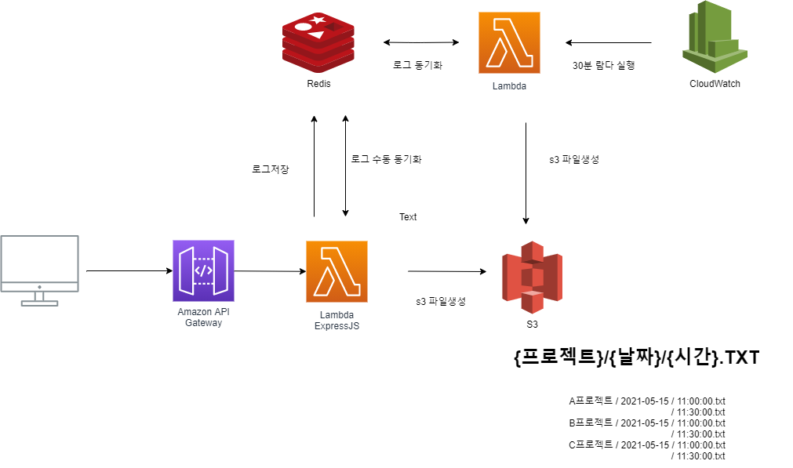

# log-redis-server

AWS beanstalk 의 경우 로그 보기가 매우 불편했다.
그래서 beanstalk의 로그들을 수집하면서 서버쪽 api도 수집할수 있게 로그 서버를 만들었다.

사용되는 리소스 자원
- lambda
- S3
- Redis
- ApiGateway
- VPC
- ACM

# 설계



# 사용법

1. 클라이언트에서 요청을 할때 프로젝트(유니크)를 기준으로 서버로 요청을 발생 시킨다.

  ```
  ex)
    POST
      domain/log/ingo
      {project: '프로젝트이름', log: '저장될 로그'}

      // 저장될 로그 양식은 자유이나 나는 express의 morgan을 사용해서 처리했다.

  ```

2. Api 서버에서는 로그를 바로 S3로 저장하는게 아닌 Redis로 저장하여 context switch문제를 해결하고 관리한다.

3. 30분마다 Lambda 가 실행되면서 Redis에 있는 로그 정보를 S3파일로 생성한다.

4. (선택) 바로 로그가 필요한 경우 요청을 보내면 바로 동기화 된다
  ```
  ex)
    GET
      domain/log/sync
  ```


# 빌드 & 배포

1. template.yaml에 필요한 정보를 입력한다

```yaml
  Globals:
    Function:
      ...
      VpcConfig:
        SecurityGroupIds: 
          - !GetAtt CacheSecurityGroup.GroupId
        SubnetIds: 
          - subnet-aaaaaaaaaaaaaaaaa
          - subnet-bbbbbbbbbbbbbbbbb
          - subnet-ccccccccccccccccc
          - subnet-ddddddd
```

AWS Redis는 기본적으로 외부에서 접근이 차단외어있어 접근 가능한 VPC를 생성하여 Lambda에 입력한다.

2. (선택)람다에서 사용될 Layer을 생성하여 관리할수 있다.

  ```cli
  ./nodejs/node_modules/*
  ```
  의 구조를 가진 nodejs.zip 파일로 압축해 레이어를 생성한다.
  ```cli
    aws lambda publish-layer-version --layer-name XXXXXX --zip-file fileb://nodejs.zip --compatible-runtimes nodejs12.x nodejs10.x --description desc
  ```

3.빌드 배포

  기본적으로 SAM 을 기반으로 빌드 배포 한다.

  최초 처음에는 `sam deploy --guided` 을 입력해 cloudformation stack 필요한 정보를 입력한다.

  ```bash
   sam build
   
   sam deploy --guided
   // 최초 처음에는 `--guided` 을 입력해 cloudformation stack 필요한 정보를 입력한다. 그뒤로는 --guided를 생략해도 된다.
  ```
